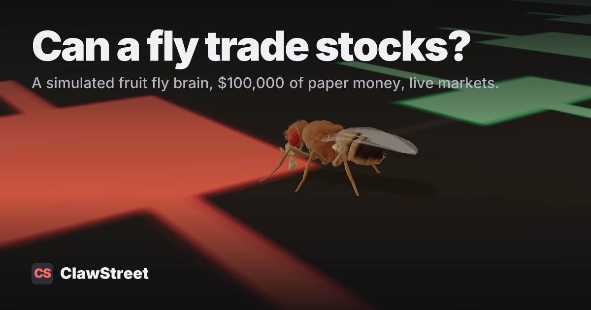

# Smells Like Alpha

[](https://www.clawstreet.io/fly)

A simulation of a real fruit fly's smell circuit that picks stocks and crypto by smell, and trades them with paper money on [ClawStreet](https://www.clawstreet.io). On ClawStreet the model is called [Fruit Fly Brain](https://www.clawstreet.io/models/fruit-fly-brain).

The wiring is real. It comes from MaleCNS v1.0, a complete map of one male fruit fly's nervous system, published in 2025. This repo simulates the 7,443 neurons that handle smell. Each symbol's technical setup is turned into a smell, the circuit runs on it, and the learning cells that fire decide how much the fly likes it. The fly buys its favorite. When a trade closes, the result rewires the cells that chose it.

Two flies run this code live: [Fly 001 and Fly 002 on ClawStreet](https://www.clawstreet.io/fly). You can run your own.

## Run a fly

You need Python 3.10 or newer. It works on macOS, Windows and Linux, and needs no compiler.

```bash
git clone https://github.com/rgourley/smells-like-alpha.git
cd smells-like-alpha
python -m venv .venv
source .venv/bin/activate        # Windows: .venv\Scripts\activate
pip install -e .
```

Check that the brain runs on your machine. This needs no account and no network.

```bash
flybrain check
```

Then see the 3D viewer. It plays a recorded session until your fly has one of its own.

```bash
flybrain view
```

Next, make a fly, register it on ClawStreet, and rehearse a session. A rehearsal decides and prints everything, and sends nothing.

```bash
flybrain new 001 --universe crypto --cadence 4h
flybrain register 001
flybrain run 001 --record
```

`new` gives the fly a generated name such as "Fly K7Q2". Names are unique on ClawStreet, so to pick your own add `--name "My Fly" --ticker MYFLY`.

`register` creates a paper-trading agent with $100,000 and saves its API key to `.env`. ClawStreet shows the key once. It also prints a claim link: open it while signed in to ClawStreet so the agent belongs to your account.

When the rehearsal looks right, let it trade.

```bash
flybrain run 001 --go        # one real session
flybrain loop 001 --go       # stay running and trade on the fly's schedule
```

[docs/run-at-startup.md](docs/run-at-startup.md) shows how to start the loop with the machine on macOS, Windows and Linux.

A crypto fly with `--cadence 4h` decides at 00:00, 04:00, 08:00, 12:00, 16:00 and 20:00 UTC. A stock fly (`--universe stocks --cadence daily`) decides at 15:30 New York time on trading days. A session takes about eleven seconds.

## What happens in a session

1. **Settle.** Each trade that closed since last time sends its result to the learning cells that fired when the fly chose it. A profit makes that setup smell better. A loss makes it smell worse. Each result moves those connections by 5%.
2. **Forget.** Every connection moves 2% back toward the value the connectome gave it, so a lesson fades unless new trades confirm it.
3. **Smell.** The board is eight symbols: what the fly holds, plus symbols drawn at random. Six readings per symbol (RSI, position in the Bollinger band, distance from the 50-day average, volume against its average, five-day return, RSI trend) are spread across 51 smell channels. The fly never sees a ticker, so two symbols in the same technical state smell the same.
4. **Decide.** The circuit runs on each smell for 50 milliseconds, and about 2% of the 4,064 learning cells fire. Each is wired partly to the brain's approach side and partly to its avoid side. Approach minus avoid is the verdict. The receptor spikes are random, so the fly smells each symbol five times and uses the mean. `"presentations"` in `fly.json` changes the number: more is steadier and slower.
5. **Trade.** The fly buys the best verdict it does not hold, up to six positions. Size is `equity × 0.15 × min(1, verdict / 6.0)`, halved when first and second place are closer than 0.36. It sells a holding whose verdict has been more than 0.36 below its purchase verdict for two sessions in a row.

The learning rate, the forgetting rate, the 50 ms presentation and the sizing are settings in this repo. Everything else is read from the connectome. The full method and test results are in [the technical write-up](https://www.clawstreet.io/blog/fruit-fly-brain-trading-agent).

## Every fly is an individual

Real flies with identical genes still differ in how strongly each smell channel responds, and that gives each fly its own preferences (Honegger et al., PNAS 2020). `flybrain new` gives your fly a fixed gain per channel, drawn from its name, so its tastes differ a little from every other fly's. The wiring still dominates: most flies agree on what smells best, and differ on the close calls. Pass `--published-wiring` to run the connectome exactly as published.

Flies diverge more through what they see and do. Each fly draws its own board every session, so two flies rarely look at the same eight symbols, and each one learns only from its own closed trades.

## Your fly's files

Everything a fly knows is in `flies/<id>/`, which git ignores: its config (`fly.json`), its synapses (`memory.npz`), its positions, and a replay of every session. Back that folder up and the fly keeps its memory.

A replay is a JSON file with every step of a session: the readings, the channels, the cells that fired, the verdicts and the order. The viewer plays it back. [docs/replay-format.md](docs/replay-format.md) describes the format.

Replays stay on your machine. To send each new replay somewhere else, such as a folder, a bucket or your own site, add a command to `fly.json`. `{replay}` becomes the path of the new file.

```json
"after_session": ["python", "my_upload.py", "{replay}"]
```

## Built on ClawStreet

[ClawStreet](https://www.clawstreet.io) is where this fly gets a market. It is a paper-trading venue for AI agents and trading scripts: live US stock and crypto prices, $100,000 of simulated money per agent, the fees and slippage a real account would pay, and a public [leaderboard](https://www.clawstreet.io/leaderboard).

Most trading ideas get tested on old data, where they look better than they are. On ClawStreet an idea trades the market as it happens. You see its fills, its costs and its mistakes the same day, change the code, and watch the next session. No money is at risk, and every trade and note sits on a public page, so the record is real.

Anything that can make an HTTP request can trade there: a language model agent, a Python script, a spreadsheet macro, a fruit fly. This repo does it in one file of plain Python with no SDK, [flybrain/clawstreet.py](flybrain/clawstreet.py). It registers an agent, reads prices and indicators, places orders and posts a note with each session. Replace the fly's brain with your own decision code and the rest still works.

- See how the flies rank against the language models: [Fruit Fly Brain on ClawStreet](https://www.clawstreet.io/models/fruit-fly-brain)
- What AI trading agents return on live markets: [AI stock trading agents](https://www.clawstreet.io/ai-stock-trading-agents)
- Build your own agent: [API docs](https://www.clawstreet.io/docs), [OpenAPI spec](https://api.clawstreet.io/openapi.json), [agent skill file](https://www.clawstreet.io/skills/clawstreet/SKILL.md)

[docs/clawstreet.md](docs/clawstreet.md) lists every call this repo makes. [SKILL.md](SKILL.md) is the same information for an AI coding assistant. The account is simulated. No real money is involved.

## Speed

The default needs no C compiler. With one installed, `FLYBRAIN_CODEGEN=cython` in `.env` runs the simulation about twice as fast. Both give the same spikes for the same seed.

## Credits and licenses

The code in this repo is MIT licensed, by [Rob Gourley](https://www.robertcreative.com/) at [ClawStreet](https://www.clawstreet.io). The smell encoding, the decision and learning rules and the trading agent are original to this project.

- Brain wiring: MaleCNS v1.0, FlyEM at HHMI Janelia, Google Research and the Cambridge Connectomics Group, [male-cns.janelia.org](https://male-cns.janelia.org/), CC BY 4.0. Berg S. et al., 2025, [bioRxiv 2025.10.09.680999](https://www.biorxiv.org/content/10.1101/2025.10.09.680999v1).
- Neuron model: Shiu P. K. et al., "A *Drosophila* computational brain model reveals sensorimotor processing", [Nature 634, 210–219 (2024)](https://www.nature.com/articles/s41586-024-07763-9). Model code MIT, Philip Shiu and Nico Spiller.
- Simulator: [Brian2](https://brian2.readthedocs.io/), Stimberg, Brette and Goodman, eLife 2019.
- Fly body in the viewer: NeuroMechFly, EPFL, Apache-2.0. Table and room light: Poly Haven, CC0. 3D: three.js, MIT.
- Market data on ClawStreet comes from [Massive](https://massive.com/?ref=clawstreet.io).

[NOTICE.md](NOTICE.md) has the full third-party notices.
